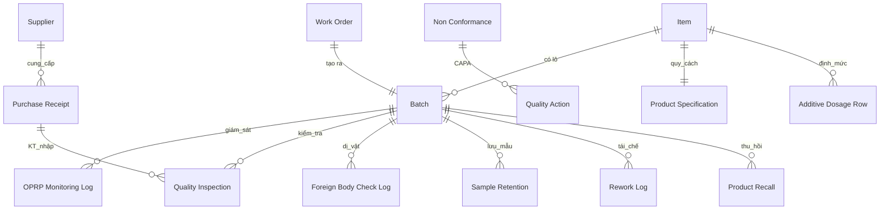

# BẢN MÔ TẢ THIẾT KẾ — HỆ THỐNG AN TOÀN THỰC PHẨM SỐ HÓA TRÊN ERPNEXT v16

**Đơn vị:** Công ty Cổ phần Hoàng Giang
**Phạm vi:** Số hóa hệ thống quản lý ATTP (ISO 22000:2018), tích hợp vào module **Quality** sẵn có của ERPNext v16, dùng **Batch + Manufacturing + Stock** cho truy xuất lô.
**Phiên bản tài liệu:** 1.0 — 16/06/2026
**Mục đích tài liệu:** Bàn giao cho (A) AI thiết kế UX/UI và (B) AI viết code custom app ERPNext v16.

---

## 0. CÁCH DÙNG TÀI LIỆU NÀY

| Người nhận | Đọc phần |
|---|---|
| **AI thiết kế (UX/UI)** | Phần 1 (nghiệp vụ, actor, use case), Phần 2 (mô hình dữ liệu để biết màn hình nào hiện gì), Phần 7 (yêu cầu UX), Phụ lục A (mapping biểu mẫu → màn hình) |
| **AI viết code ERPNext v16** | Phần 2 → 6 (DocType, permission, workflow, hooks, fixtures), Phần 8 (chuẩn kỹ thuật), Phụ lục A & B |

**Quy ước:** Tài liệu viết tiếng Việt, giữ thuật ngữ kỹ thuật tiếng Anh (DocType, fieldtype, Link, Child Table, Quality Inspection...). Tên app đề xuất: `hg_food_safety` (module hiển thị: **Food Safety**). Tên DocType: Title Case. Fieldname: snake_case. Custom field trên DocType core: prefix `custom_`.

**Nguyên tắc thiết kế chủ đạo:** *Reuse > Create.* Ưu tiên dùng DocType lõi của ERPNext (Quality, Manufacturing, Stock, Buying, Asset, HR); chỉ tạo DocType mới cho nghiệp vụ ATTP không có sẵn. **Mã lô = `Batch` là chìa khóa truy xuất xuyên suốt mọi bản ghi.**

---

## PHẦN 1 — BUSINESS MODEL

### 1.1 Bối cảnh
Công ty sản xuất bánh đậu xanh (2 quy cách: **hộp tiểu** và **khay**, đều bao nilon), bột đậu xanh dinh dưỡng, chè đậu đen cốt dừa. Đã vận hành hệ thống ISO 22000:2018 với bộ quy trình QT01–QT12, PRP/SSOP, kế hoạch HACCP (kết luận **không có CCP**, kiểm soát bằng OPRP/PRP), OPRP, kiểm nghiệm & giám sát môi trường, thẩm định hạn sử dụng. Hiện ghi chép bằng sổ giấy/biểu mẫu. Công ty đã dùng ERPNext v16 cho các mảng khác và muốn số hóa ATTP **tích hợp vào module Quality**.

### 1.2 Quy mô & thiết bị
- Quy mô SME; vài chục người dùng; ghi nhận theo **ca** và theo **lô sản xuất**.
- Thiết bị nhập liệu: **điện thoại/máy tính bảng** cho công nhân/KCS tại line (ưu tiên UI tối giản, chạm nhanh); **web** cho quản lý/Ban ISO.

### 1.3 Pain point hiện tại
Hồ sơ giấy rời rạc, dễ quên việc, khó truy xuất theo lô, khó tổng hợp/báo cáo, không có cảnh báo khi vượt giới hạn, chữ ký tay khó kiểm soát.

### 1.4 Actors & Roles — THỰC TẾ: chỉ 2 người dùng phần mềm
Thực tế tại công ty, **chỉ KCS và QA (anh chủ — kiêm Ban ISO) thao tác trên phần mềm**. Công nhân, cơ điện, kho, mua hàng KHÔNG đăng nhập; thao tác của họ hoặc do KCS nhập hộ, hoặc ghi giấy tại chỗ rồi KCS xác nhận/nhập tổng hợp.

| Người dùng phần mềm | Role | Làm gì trên phần mềm |
|---|---|---|
| **KCS** | `FS QC` | Nhập dữ liệu kiểm soát hằng ngày/theo lô: KT NVL nhập, giám sát OPRP & công đoạn, KT thành phẩm, lưu mẫu, dị vật/đầu dò, xác nhận vệ sinh & nước, ghi nhận không phù hợp |
| **QA (anh)** | `FS QA Manager` (+ `System Manager`) | Thiết lập dữ liệu nền & tài liệu, duyệt giải phóng lô, CAPA, đánh giá nội bộ/thẩm tra, thu hồi, phê duyệt nhãn, xem dashboard & báo cáo |

Các vai trò khác (Operator, Supervisor, Maintenance, Warehouse, Purchasing, Executive) **không tạo tài khoản giai đoạn này** — giữ trong thiết kế để mở rộng về sau, nhưng quyền không kích hoạt.

> Hệ quả: dữ liệu do nhiều bộ phận sinh ra (vệ sinh, bảo dưỡng, mua hàng) được đưa vào phần mềm **ở mức tối thiểu, do KCS/QA nhập**, để 2 người không quá tải — xem **Phần 9** (cái gì vào phần mềm / cái gì giữ giấy + kịch bản vận hành).

### 1.5 Use cases chính
- **US-01** Công nhân ghi *Giám sát công đoạn & OPRP* theo lô mỗi ca; vượt giới hạn → hệ thống cảnh báo, yêu cầu cô lập lô, mở CAPA.
- **US-02** KCS thực hiện *Kiểm tra NVL nhập* gắn Purchase Receipt (đặc biệt aflatoxin cho lạc/đậu); không đạt → chặn nhập/cô lập.
- **US-03** KCS thực hiện *Kiểm tra thành phẩm* theo lô (khối lượng, mối hàn, đầu dò kim loại, nhãn) trước khi nhập kho/xuất.
- **US-04** KCS ghi *Lấy mẫu lưu* theo lô; nhắc tự động khi đến hạn hủy mẫu.
- **US-05** Công nhân/KCS ghi *Nhật ký vệ sinh* hằng ngày; *Vệ sinh định kỳ & diệt côn trùng* theo lịch.
- **US-06** Ban ISO mở *Thu hồi sản phẩm* hoặc *Diễn tập thu hồi*; truy xuất toàn bộ hồ sơ theo lô trong vài phút.
- **US-07** Ban ISO lập & theo dõi *Đánh giá nội bộ*, *Thẩm tra hệ thống*, *CAPA* đến khi đóng.
- **US-08** Cơ điện theo dõi *Bảo dưỡng* và *Hiệu chuẩn thiết bị*; hệ thống nhắc trước hạn.
- **US-09** Mua hàng *Đánh giá nhà cung cấp* (chấm điểm) và duy trì danh sách NCC được duyệt.
- **US-10** Ban ISO quản lý *Tài liệu* (ban hành/sửa đổi, danh mục nội bộ/bên ngoài) và *Quy cách & phê duyệt nhãn* sản phẩm.
- **US-11** Hệ thống đẩy *lịch công việc ATTP* theo tần suất (ngày/tuần/tháng/6 tháng/năm) và nhắc việc đến hạn.

### 1.6 Data sources hiện có (dùng làm input migration/cấu hình)
Bộ biểu mẫu chuẩn hóa (45 biểu mẫu — xem Phụ lục A), Bảng định mức phụ gia BM.PG.01 (TT 24/2019/TT-BYT nhóm 07.2), Danh mục nguyên vật liệu DM.NVL.01, Lịch công việc ATTP, Danh mục tài liệu nội bộ/hồ sơ.

### 1.7 Integration scope (module lõi sẽ tích hợp)
**Quality** (Quality Inspection/Template, Quality Procedure, Quality Goal/Review/Meeting, Quality Action, Non Conformance) · **Manufacturing** (Work Order, Job Card, BOM, Operation) · **Stock** (Item, Batch, Purchase Receipt, Stock Entry, Warehouse, Item Group) · **Buying** (Supplier, Supplier Scorecard) · **Assets** (Asset, Asset Maintenance) · **HR** (Employee, Training Event/Result).

### 1.8 Constraints
Giao diện tiếng Việt; mobile-friendly tại xưởng; **audit trail** (track changes, không sửa lén); căn cứ pháp lý hiện hành (Luật ATTP 2010 sửa đổi 2018; **Nghị định 46/2026/NĐ-CP** thay thế NĐ 15/2018; NĐ 155/2018; TT 24/2019/TT-BYT; QCVN 8-1/8-2/8-3, QCVN 01-1:2018/BYT).

---

## PHẦN 2 — DOCTYPE BLUEPRINT

### 2.1 Tái sử dụng DocType lõi (KHÔNG tạo mới)
| Nghiệp vụ | DocType lõi dùng | Tùy biến |
|---|---|---|
| Sản phẩm, NVL, phụ gia, bao bì | **Item** | Item Group: `Thành phẩm`, `Nguyên vật liệu`, `Phụ gia - Phẩm màu`, `Bao bì`. Bật `has_batch_no=1` cho thành phẩm. Custom fields ở 2.3 |
| Lô sản xuất (mã lô) | **Batch** | Naming series `HG-.YYYY..MM..DD.-.##`; custom fields trạng thái ATTP (2.3) |
| Sản xuất theo lô | **Work Order** + **Job Card** | Operation: Rang → Nghiền → Trộn → Tạo viên → Đóng gói |
| Kiểm tra NVL nhập | **Quality Inspection** (`reference_type=Purchase Receipt`) + **Quality Inspection Template** | Template "KT NVL nhập" theo nhóm; reading aflatoxin cho lạc/đậu |
| Kiểm tra thành phẩm | **Quality Inspection** (`reference_type=Work Order`/`Stock Entry`) + **Template** "KT thành phẩm" | Reading: khối lượng, mối hàn, đầu dò kim loại, nhãn |
| Đánh giá nhà cung cấp | **Supplier Scorecard** (+ Variable/Criteria) | Tiêu chí: chất lượng, hồ sơ/COA, giao hàng, giá |
| Nhà cung cấp được duyệt | **Supplier** | custom field `custom_approved`, `custom_reeval_date` |
| Thiết bị & bảo dưỡng | **Asset** + **Asset Maintenance** (+ Log) | Nhóm thiết bị SX & thiết bị đo |
| Quy trình/SSOP/thủ tục | **Quality Procedure** (tree) | QT01–QT12, SSOP1–7 |
| Xem xét lãnh đạo / mục tiêu | **Quality Goal** + **Quality Review** + **Quality Meeting** | Mục tiêu ATTP & họp xem xét |
| Hành động khắc phục/phòng ngừa (CAPA) | **Non Conformance** + **Quality Action** | Mọi "không đạt" mở Non Conformance → Quality Action |
| Đào tạo/tập huấn ATTP | **Training Event** + **Training Result** | Lưu kết quả tập huấn VSATTP |

> **Lưu ý CCP/OPRP:** Quality Inspection của ERPNext phù hợp cho kiểm tra điểm (nhập/thành phẩm). Giám sát OPRP liên tục theo ca cần DocType riêng (2.2) vì có giới hạn hành động + cô lập lô + tần suất theo ca.

### 2.2 DocType mới (module Food Safety)
Mỗi DocType có chuẩn: `Track Changes = Yes`. DocType giao dịch có cô lập/duyệt đặt `Is Submittable = Yes`. Trường truy xuất chung: `batch_no` (Link → Batch), `production_date`, `shift` (Select: Sáng/Chiều/Tối).

#### 2.2.1 OPRP Monitoring Log (`oprp_monitoring_log`)
- Module: Food Safety · Naming: `OPRP-.YYYY.-.#####` · Submittable: Yes · Title: `batch_no`
- Mục đích: giám sát OPRP theo ca/lô (thay BM.08.02).

| Fieldname | Label | Type | Options | Reqd | Notes |
|---|---|---|---|---|---|
| log_date | Ngày | Date | | ✓ | default today |
| shift | Ca | Select | Sáng\nChiều\nTối | ✓ | |
| batch_no | Lô | Link | Batch | ✓ | |
| work_order | Lệnh SX | Link | Work Order | | fetch từ batch |
| readings | Chi tiết giám sát | Table | OPRP Reading | ✓ | child |
| has_deviation | Có vượt giới hạn | Check | | | auto = any(reading not ok) |
| corrective_action | Hành động khắc phục | Small Text | | | reqd nếu has_deviation |
| monitored_by | Người giám sát | Link | Employee | ✓ | |

Child **OPRP Reading** (`oprp_reading`): `oprp_step` (Data — công đoạn/OPRP), `parameter` (Data), `action_limit` (Data — giới hạn hành động), `result` (Data), `status` (Select: Đạt\nKhông đạt).

#### 2.2.2 Foreign Body Check Log (`foreign_body_check_log`)
- Naming: `FBC-.YYYY.-.#####` · Submittable: No · thay BM.10.01.
- Fields: `log_date`(Date,✓), `shift`(Select,✓), `batch_no`(Link Batch), `stage`(Data), `sieve_status`(Select: Nguyên vẹn-đúng cỡ\nBất thường), `metal_detector`(Select: Không báo\nBáo\nKhông áp dụng), `foreign_body_found`(Small Text), `status`(Select: Đạt\nKhông đạt,✓), `action`(Small Text — reqd nếu Không đạt), `checked_by`(Link Employee,✓).
- Quy tắc: nếu `metal_detector=Báo` hoặc `sieve_status=Bất thường` hoặc `status=Không đạt` → set `batch.custom_qc_hold=1` và tạo Non Conformance.

#### 2.2.3 Finished Product Check — dùng Quality Inspection
Không tạo DocType riêng. Dùng **Quality Inspection** + **Template "KT thành phẩm"** với reading: `khoi_luong` (numeric, min/max ±20g), `moi_han` (value Đạt/Không), `dau_do_kim_loai` (Đạt/Báo), `nhan_date` (Đạt/Không), `so_mau_kiem` (=20). Link `batch_no`. Reject → batch hold.

#### 2.2.4 Sample Retention (`sample_retention`)
- Naming: `LM-.YYYY.-.#####` · thay BM.QD.01.
- Fields: `retention_date`(Date,✓), `item`(Link Item), `batch_no`(Link Batch,✓), `qty`(Int), `location`(Data), `keep_until`(Date — auto = NSX + HSD), `disposed_on`(Date), `kept_by`/`disposed_by`(Link Employee).
- Scheduler nhắc khi `keep_until` đến hạn.

#### 2.2.5 Glass & Brittle Plastic Register (`glass_brittle_register`)
- Single-purpose register (Submittable: No) thay BM.10.02. Parent fields: `area`(Data). Child **Glass Item** (`glass_item`): `location`, `type`(đèn/kính/đồng hồ…), `qty`, `last_check_date`, `condition`(Select: Nguyên vẹn\nVỡ), `action_if_broken`. Kèm field `floor_plan`(Attach Image).

#### 2.2.6 Breakage Incident (`breakage_incident`)
- Thay BM.10.03. Fields: `incident_datetime`(Datetime,✓), `location`, `broken_item`, `affected_batch`(Link Batch), `containment`(Small Text), `result`(Small Text), `handled_by`(Link Employee). Tạo Non Conformance liên kết.

#### 2.2.7 Chemical Register (`chemical_register`)
- Thay BM.10.04. Fields: `chemical_name`(Data,✓), `purpose`, `area`, `has_sds`(Check), `sds_file`(Attach), `storage_location`, `responsible`(Link Employee).

#### 2.2.8 Rework Log (`rework_log`)
- Naming `RW-.YYYY.-.#####` · thay BM.10.05. Fields: `log_date`(Date), `item`(Link Item), `source_batch`(Link Batch,✓), `rework_qty`(Float), `target_batch`(Link Batch,✓), `rework_pct`(Percent — auto), `like_into_like`(Check — bắt buộc tick), `approved_by`(Link Employee). Validate: chỉ cho phép khi `like_into_like=1`.

#### 2.2.9 Environmental Monitoring (`environmental_monitoring`)
- Thay BM.KN.02. Fields: `sample_date`(Date), `location`(Data — bề mặt/không khí), `parameter`(Data — TPC/Coliform), `warning_limit`(Data), `action_limit`(Data), `result`(Data), `status`(Select: Đạt\nCảnh báo\nHành động), `corrective_action`, `tested_by`(Link Employee).

#### 2.2.10 Lab Test Plan & Result (`lab_test_result`)
- Thay BM.KN.01. Fields: `sample_date`(Date), `target_type`(Select: Sản phẩm\nNước\nNguyên liệu), `item`(Link Item, optional), `batch_no`(Link Batch, optional), `parameter`(Data), `limit_basis`(Data — QCVN), `result`(Data), `status`(Select: Đạt\nKhông đạt), `lab`(Data — ISO/IEC 17025), `action_if_fail`(Small Text).

#### 2.2.11 Water Control Log (`water_control_log`)
- SSOP1. Fields: `log_date`(Date), `shift`(Select), `first_flush_done`(Check — công nhân tự xác nhận), `sensory_ok`(Select: Đạt\nBất thường), `note`, `recorded_by`(Link Employee). (Kết quả kiểm nghiệm nước lưu ở `lab_test_result` với target_type=Nước.)

#### 2.2.12 Shelf Life Study (`shelf_life_study`)
- Thay BM.SL.01. Parent: `item`(Link Item,✓), `storage_condition`, `conclusion`(Small Text). Child **Shelf Life Reading** (`shelf_life_reading`): `time_point`(Data — 0/1/3/6/9 tháng), `sensory`, `microbio`, `physchem`, `result`(Select: Đạt\nKhông đạt).

#### 2.2.13 Food Defense Assessment (`food_defense_assessment`)
- Thay BM.11.01 (TACCP/VACCP). Parent: `assessment_date`, `scope`, `reviewed_by`. Child **Threat Item** (`threat_item`): `point`(Data), `threat`(Small Text), `likelihood`(Int 1-5), `severity`(Int 1-5), `score`(Int — auto = L×S), `control`, `residual_risk`(Data).

#### 2.2.14 Product Specification (`product_specification`)
- Thay BM.12.01. Fields: `item`(Link Item,✓, unique), `ingredients`(Text), `additives`(Table → liên kết Additive Dosage), `sensory_spec`, `physchem_spec`, `microbio_spec`, `packaging_spec`, `shelf_life`, `label_info`(Text), `self_declaration_no`(Data).

#### 2.2.15 Additive Dosage Spec (`additive_dosage_spec`) + child
- Thay BM.PG.01. Single hoặc per-product. Child **Additive Dosage Row** (`additive_dosage_row`): `additive_name`, `ins`(Data), `function`, `product`(Link Item), `max_level`(Data — ML theo TT 24/2019 nhóm 07.2), `actual_level`(Data), `legal_basis`(Data).

#### 2.2.16 Label Approval (`label_approval`)
- Naming `LBL-.YYYY.-.####` · Submittable: Yes · thay BM.12.02. Fields: `item`(Link Item), `label_version`(Data), `checklist`(Table) — child **Label Checklist Item**: `criterion`(Data), `result`(Select: Đạt\nKhông đạt). `nd111_compliant`(Check), `approved_by`(Link Employee), `approved_on`(Date). On Submit = nhãn được duyệt mới cho in.

#### 2.2.17 Sanitation Log (`sanitation_log`)
- Thay BM.VS.01 (gộp vệ sinh công nhân + xưởng). Parent: `log_date`(Date), `shift`(Select). Child **Sanitation Item** (`sanitation_item`): `category`(Select: Cá nhân\nBề mặt-Thiết bị\nKhu vực\nChất thải), `content`(Data), `result`(Select: Đạt\nKhông đạt), `action`(Data). `checked_by`(Link Employee).

#### 2.2.18 Periodic Sanitation & Pest Control (`periodic_sanitation_log`)
- Thay BM.VS.02. Fields: `log_date`, `category`(Data), `frequency`(Select: 15 ngày\nTháng\nQuý), `area`, `method`, `result`, `performed_by`(Data — đơn vị/người).

#### 2.2.19 Product Recall (`product_recall`) + Mock Recall
- Naming `TH-.YYYY.-.###` · Submittable: Yes · Workflow (Phần 4) · thay BM.02.01+02.02.
- Fields: `recall_type`(Select: Thật\nDiễn tập), `batch_no`(Link Batch,✓), `item`(Link Item), `recall_level`(Select: A\nB\nC), `reason`(Small Text), `qty_produced`(Float), `qty_shipped`(Float), `qty_recovered`(Float), `recovery_pct`(Percent — auto), `qty_stock`(Float), `disposition`(Small Text), `root_cause`(Small Text), `preventive_action`(Small Text), steps child **Recall Step** (`task`, `responsible`, `due`, `result`).
- Mock recall đo: `trace_time_hours`(Float), `trace_pct`(Percent), `target`(Data), `meets_target`(Check).

#### 2.2.20 Internal Audit (`internal_audit`) + child
- Thay BM.01.05/06/09. Parent: `audit_date`, `scope`, `auditors`(Table Employee). Child **Audit Finding** (`audit_finding`): `clause`(Data — điều khoản ISO), `question`, `evidence`, `result`(Select: Phù hợp\nKhông phù hợp\nKhuyến nghị), `severity`(Select: Nặng\nNhẹ), `quality_action`(Link Quality Action).

#### 2.2.21 Verification Plan/Report (`verification_record`)
- Thay BM.04.01/02. Parent: `period`, child **Verification Item**: `category`(Data), `content`, `method`, `result`, `passed`(Check), `recommendation`.

#### 2.2.22 Risk & Opportunity Register (`risk_register`) + Interested Party (`interested_party`)
- Thay BM.05.02/05.01. Risk fields: `context`, `risk_opportunity`, `likelihood`(Int 1-5), `consequence`(Int 1-5), `level`(Int auto=L×C), `control`, `residual_risk`, `owner`(Link Employee), `due`. Interested Party: `party`, `needs`, `requirement`, `how_to_meet`.

#### 2.2.23 Emergency Drill & Incident (`emergency_record`) + Emergency Equipment Log (`fire_equipment_log`)
- Thay BM.03.04 và BM.03.01. Emergency: `record_date`, `type`(Select: Cháy\nBão lũ\nRò điện\nDịch bệnh\nThông tin SP), `mode`(Select: Thật\nDiễn tập), `description`, `actions`, `result`, `improvement`. Fire equipment: child list thiết bị PCCC với `next_check_date`.

#### 2.2.24 Calibration Record (`calibration_record`)
- Thay BM.06.03. Fields: `asset`(Link Asset,✓), `method`(Select: Nội bộ\nBên ngoài), `reference_standard`, `tolerance`, `result`, `passed`(Check), `calibration_date`, `next_due`(Date). Scheduler nhắc trước 30 ngày.

#### 2.2.25 Controlled Document (`controlled_document`) + Document Change Request (`doc_change_request`)
- Thay BM.01.01/02/03/04. Controlled Document: `doc_name`, `doc_code`, `doc_type`(Select: Nội bộ\nBên ngoài), `version`, `effective_date`, `status`(Select: Hiệu lực\nĐã thay thế\nHết hiệu lực), `superseded_by`, `location`, `retention`. Doc Change Request: `requested_by`, `target_doc`(Link Controlled Document), `change_type`(Select: Ban hành\nSửa đổi\nHủy), `reason`, `old_version`, `new_version`, `approved_by`, `old_copy_withdrawn`(Check). Workflow ở Phần 4.

### 2.3 Custom Fields trên DocType lõi
| DocType | Fieldname | Type | Mục đích |
|---|---|---|---|
| Item | `custom_fs_category` | Select | Thành phẩm/NVL/Phụ gia/Bao bì |
| Item | `custom_storage_condition` | Small Text | Điều kiện bảo quản |
| Item | `custom_qc_required_docs` | Small Text | Hồ sơ yêu cầu khi nhập (COA, aflatoxin…) |
| Item | `custom_legal_basis` | Small Text | TCVN/QCVN áp dụng |
| Batch | `custom_qc_status` | Select | Đang SX/Đạt/Cô lập/Hủy |
| Batch | `custom_qc_hold` | Check | Cờ cô lập (auto khi không đạt) |
| Batch | `custom_oprp_ok` | Check | OPRP trong tầm kiểm soát |
| Supplier | `custom_approved` | Check | NCC được duyệt |
| Supplier | `custom_reeval_date` | Date | Ngày tái đánh giá |
| Purchase Receipt | `custom_aflatoxin_coa` | Attach | COA aflatoxin (lạc/đậu) |
| Asset | `custom_need_safety_inspection` | Check | Thiết bị cần kiểm định an toàn |

### 2.4 ERD (trọng tâm Batch)


---

## PHẦN 3 — PERMISSION MATRIX

> **Thực tế chỉ 2 role hoạt động:** `FS QC` (KCS) và `FS QA Manager` (anh). Cấu hình tối thiểu cần làm:
> - `FS QC`: Create/Write/Submit mọi DocType ghi nhận hằng ngày/theo lô + Quality Inspection; Read tài liệu/quy cách; **KHÔNG** xóa, **KHÔNG** duyệt giải phóng lô/đóng CAPA/đóng recall.
> - `FS QA Manager` (+ `System Manager`): toàn quyền mọi DocType Food Safety + quyền duyệt (Submit/Cancel, đóng CAPA, phê duyệt nhãn, đóng recall) + ghi field permlevel 1 (kết luận/duyệt).
>
> Ma trận chi tiết bên dưới giữ cho mở rộng về sau (khi thêm Operator/Supervisor…).

Ký hiệu: R=Read, W=Write, C=Create, D=Delete, Sub=Submit, Cnl=Cancel, IfO=If Owner.

### DocType: OPRP Monitoring Log / Foreign Body / Sanitation Log / Water Control
| Role | R | W | C | D | Sub | IfO |
|---|---|---|---|---|---|---|
| FS Operator | ✓ | ✓ | ✓ | | ✓ | ✓ |
| FS QC Inspector | ✓ | ✓ | ✓ | | ✓ | |
| FS Supervisor | ✓ | ✓ | ✓ | | ✓ | |
| FS QA Manager | ✓ | ✓ | ✓ | ✓ | ✓ | |
| FS Executive | ✓ | | | | | |

### DocType: Quality Inspection (KT NVL nhập / thành phẩm)
| Role | R | W | C | Sub |
|---|---|---|---|---|
| FS QC Inspector | ✓ | ✓ | ✓ | ✓ |
| FS Warehouse | ✓ | ✓ | ✓ | |
| FS QA Manager | ✓ | ✓ | ✓ | ✓ |

### DocType: Product Recall / Internal Audit / Verification / Risk Register / Controlled Document / Additive Dosage / Product Specification / Label Approval
| Role | R | W | C | D | Sub |
|---|---|---|---|---|---|
| FS QA Manager | ✓ | ✓ | ✓ | ✓ | ✓ |
| FS Executive | ✓ | | | | ✓ (phê duyệt) |
| FS Supervisor | ✓ | | | | |
| Khác | ✓ (chỉ đọc tài liệu liên quan) | | | | |

### DocType: Supplier Scorecard / Supplier (duyệt NCC)
| Role | R | W | C | Sub |
|---|---|---|---|---|
| FS Purchasing | ✓ | ✓ | ✓ | |
| FS QA Manager | ✓ | ✓ | ✓ | ✓ |

### DocType: Asset / Asset Maintenance / Calibration Record
| Role | R | W | C |
|---|---|---|---|
| FS Maintenance | ✓ | ✓ | ✓ |
| FS QA Manager | ✓ | ✓ | ✓ |

**User Permission:** FS Operator chỉ thấy bản ghi do mình tạo (If Owner) trên các log vận hành; FS Supervisor giới hạn theo bộ phận (nếu cần) qua User Permission trên Department. Permlevel 1: khóa các field kết luận/duyệt (chỉ FS QA Manager/Executive ghi được — vd `approved_by`, `disposition`).

---

## PHẦN 4 — WORKFLOW BLUEPRINT

### 4.1 Workflow: Product Recall
| State | docstatus | Allow Edit Roles |
|---|---|---|
| Nháp | 0 | FS QA Manager |
| Đang thu hồi | 0 | FS QA Manager |
| Chờ phê duyệt đóng | 0 | FS QA Manager |
| Đã đóng | 1 | (none) |

| From | To | Action | Role | Condition |
|---|---|---|---|---|
| Nháp | Đang thu hồi | Phát lệnh | FS QA Manager | batch_no, recall_level đã nhập |
| Đang thu hồi | Chờ phê duyệt đóng | Hoàn tất | FS QA Manager | qty_recovered nhập, recovery_pct tính |
| Chờ phê duyệt đóng | Đã đóng | Phê duyệt | FS Executive | root_cause & preventive_action có |

### 4.2 Workflow: Document Change Request
Nháp → Chờ duyệt (FS QA Manager) → Đã duyệt/Từ chối (FS Executive). Khi "Đã duyệt": cập nhật `version`, `effective_date` trên Controlled Document; đặt bản cũ `status=Đã thay thế`; yêu cầu tick `old_copy_withdrawn`.

### 4.3 Workflow: Non Conformance → Quality Action (CAPA)
Open → Investigation (root cause) → Action Taken → Verified/Closed. Dùng cơ chế Quality Action lõi; chỉ FS QA Manager mới chuyển sang "Closed" sau khi xác nhận hiệu lực.

### 4.4 Workflow: Label Approval
Nháp → Chờ duyệt → Đã duyệt (Submit, FS QA Manager). Chỉ nhãn ở trạng thái "Đã duyệt" mới được phép in/sử dụng.

> Các DocType log vận hành (OPRP, dị vật, vệ sinh, nước) **không cần workflow** — chỉ dùng `docstatus` (Submit) + field `status`. Tránh nhồi workflow vào ghi nhận hằng ngày để giữ thao tác nhanh.

---

## PHẦN 5 — INTEGRATION & HOOKS PLAN

### 5.1 Touch points với core
- **Purchase Receipt** → bắt buộc Quality Inspection cho Item nhóm `Nguyên vật liệu` (set `inspection_required_before_purchase`). Không đạt → chặn submit hoặc cảnh báo + cô lập.
- **Work Order / Stock Entry (Manufacture)** → tạo `Batch` cho thành phẩm; mở Quality Inspection thành phẩm; gắn các log theo `batch_no`.
- **Batch** → là tâm truy xuất; trang Batch hiển thị mọi bản ghi ATTP liên quan (qua Dashboard Links).
- **Supplier** → đồng bộ `custom_approved` từ Supplier Scorecard ngưỡng điểm.

### 5.2 hooks.py (kế hoạch)
```python
doc_events = {
  "Quality Inspection": {
     "on_submit": "hg_food_safety.api.qc.on_inspection_submit",   # reject → set batch hold + tạo Non Conformance
  },
  "OPRP Monitoring Log": {
     "validate": "hg_food_safety.api.oprp.compute_deviation",
     "on_submit": "hg_food_safety.api.oprp.handle_deviation",      # vượt giới hạn → cô lập lô + CAPA
  },
  "Foreign Body Check Log": {
     "on_submit": "hg_food_safety.api.fbc.handle_fail",
  },
  "Rework Log": {
     "validate": "hg_food_safety.api.rework.enforce_like_into_like",
  },
  "Stock Entry": {
     "on_submit": "hg_food_safety.api.batch.init_finished_batch",
  },
  "Doc Change Request": {
     "on_update_after_submit": "hg_food_safety.api.docs.apply_version",
  },
}

scheduler_events = {
  "daily": [
     "hg_food_safety.tasks.push_daily_checklist",     # đẩy lịch công việc theo tần suất
     "hg_food_safety.tasks.remind_sample_disposal",   # nhắc hủy mẫu lưu đến hạn
     "hg_food_safety.tasks.remind_calibration_due",   # nhắc hiệu chuẩn/kiểm định trước hạn
     "hg_food_safety.tasks.remind_lab_test_due",      # nhắc kiểm nghiệm định kỳ
     "hg_food_safety.tasks.remind_supplier_reeval",   # nhắc tái đánh giá NCC
  ],
}

fixtures = ["Role", "Custom Field", "Property Setter", "Workflow", "Workflow State",
            "Workflow Action Master", "Quality Inspection Template", "Print Format",
            "Number Card", "Dashboard Chart", "Notification"]
```

### 5.3 Whitelisted API (cho app mobile/PWA)
- `GET hg_food_safety.api.tasks.my_today` — việc cần làm hôm nay theo user/ca.
- `POST hg_food_safety.api.oprp.quick_log` — ghi nhanh giám sát OPRP.
- `GET hg_food_safety.api.trace.by_batch?batch_no=...` — trả toàn bộ hồ sơ theo lô (truy xuất/thu hồi).
- `POST hg_food_safety.api.qc.submit_inspection` — gửi kết quả kiểm tra + ảnh.

### 5.4 Background jobs
CAPA/thu hồi: enqueue tổng hợp truy xuất theo lô (queue `long`, timeout 300s). Cảnh báo realtime khi `batch hold` → `frappe.publish_realtime` + Notification cho FS QA Manager.

---

## PHẦN 6 — FIXTURES PLAN

### 6.1 Roles (ship qua fixtures)
`FS Operator`, `FS QC Inspector`, `FS Supervisor`, `FS QA Manager`, `FS Maintenance`, `FS Warehouse`, `FS Purchasing`, `FS Executive`.

### 6.2 Custom Fields & Property Setters
Toàn bộ custom field ở 2.3 (filter theo dt). Property Setter: `Batch.search_fields = "item,custom_qc_status"`; bật `Item.has_batch_no` cho nhóm thành phẩm; `Item Group` mặc định.

### 6.3 Quality Inspection Templates (fixtures)
- "KT NVL nhập — Lạc/Đậu" (reading: cảm quan, độ ẩm, **aflatoxin B1 & tổng số ≤ QCVN 8-1:2011/BYT**, COA).
- "KT NVL nhập — Đường/Dầu/Bột" (cảm quan, độ ẩm, HSD, bao bì).
- "KT NVL nhập — Bao bì nhựa/nhôm" (CB hợp quy QCVN 12-1, quy cách).
- "KT thành phẩm" (khối lượng ±20g, mối hàn, đầu dò kim loại, nhãn/date, số mẫu kiểm).

### 6.4 Workflows (fixtures)
Product Recall, Document Change Request, Label Approval, Non Conformance/CAPA (nếu tùy biến).

### 6.5 Print Formats (fixtures)
Phiếu kiểm tra thành phẩm, Biên bản thu hồi, Phiếu giám sát OPRP, Bản quy cách sản phẩm, Bảng định mức phụ gia, Báo cáo đánh giá nội bộ — letter head Hoàng Giang.

### 6.6 Dashboard & Number Cards (fixtures)
Number Cards: "Việc hôm nay", "Cảnh báo/cô lập lô", "Lô đang SX", "Kiểm nghiệm sắp đến hạn". Dashboard Charts: tỷ lệ đạt KT thành phẩm theo tuần, số NC theo công đoạn, % truy xuất mock recall.

### 6.7 Patches dự kiến (làm ở nextcode-build)
`v0_0_1.create_fs_roles`, `v0_0_1.set_batch_naming`, `v0_0_1.seed_quality_procedures` (QT01–12, SSOP), `v0_0_1.seed_additive_dosage` (từ BM.PG.01), `v0_0_1.seed_items_from_nvl` (từ DM.NVL.01).

---

## PHẦN 7 — YÊU CẦU UX/UI (cho AI thiết kế)

- **Thực tế 2 người dùng:** (1) **KCS** thao tác trên **máy tính bảng/PC tại bàn QC** (KHÔNG phải công nhân ghi trên điện thoại tại line) — màn hình "Việc hôm nay" theo ca + form theo lô (toggle Đạt/Không, số, chụp ảnh COA/sản phẩm); (2) **QA (anh)** trên **web desktop** — dashboard, cảnh báo, duyệt, truy xuất theo lô, báo cáo. Ưu tiên nhập nhanh, ít bước; KHÔNG cần phát triển app cho nhiều công nhân.
- **Nguyên tắc:** tối thiểu thao tác; `batch_no` chọn 1 lần đầu ca rồi giữ ngữ cảnh; trường phán định dạng nút lớn; cảnh báo đỏ + chặn lưu khi thiếu hành động khắc phục lúc "Không đạt".
- **Truy xuất theo lô:** 1 màn hình timeline: NVL nhập (COA) → giám sát OPRP → KT thành phẩm → lưu mẫu → (thu hồi nếu có).
- **Ngôn ngữ:** tiếng Việt; thuật ngữ ngắn gọn cho công nhân.
- **Offline-tolerant** (PWA) tại xưởng nếu wifi yếu: cache form, đồng bộ khi có mạng (gợi ý, tùy nguồn lực).
- Tham chiếu mockup khái niệm đã thống nhất: màn hình điện thoại ghi theo lô + dashboard QA.

---

## PHẦN 8 — CHUẨN KỸ THUẬT (cho AI code ERPNext v16)

- Frappe/ERPNext **v16**; Python 3.11+; app `hg_food_safety` cài trên site đã có ERPNext.
- Tôn trọng **Reuse > Create**: không tạo DocType song song với Item/Batch/Supplier/Asset.
- Mọi DocType ATTP: `track_changes=1`; field truy xuất `batch_no` Link → Batch; đặt **Dashboard Links** trên Batch để hiển thị các log liên quan.
- Validation/automation qua **controller (.py)** + `hooks.doc_events`, KHÔNG nhồi vào Server Script trừ tùy chỉnh nhỏ.
- Naming series khai báo trong DocType (autoname) — không hardcode.
- Permission: cấu hình DocPerm theo Phần 3 + permlevel cho field kết luận/duyệt.
- i18n: nhãn tiếng Việt qua translation; fieldname snake_case tiếng Anh.
- Test: FrappeTestCase cho luồng cô lập lô khi reject, tính `recovery_pct`, enforce like-into-like, apply version tài liệu.
- Bàn giao kèm: hooks.py, DocType JSON, controllers, whitelisted API, fixtures, print formats, patches.

---

## PHẦN 9 — KỊCH BẢN VẬN HÀNH THỰC TẾ (2 NGƯỜI DÙNG: KCS + QA)

### 9.1 Cái gì vào phần mềm / cái gì giữ giấy
Để 2 người không quá tải, chỉ số hóa các điểm kiểm soát giá trị cao; việc rủi ro thấp giữ giấy tại chỗ, KCS xác nhận/nhập gọn.

| Nhóm | Vào phần mềm (ai nhập) | Giữ giấy + nhập tối giản |
|---|---|---|
| KT NVL nhập (lạc/aflatoxin) | ✓ KCS — mỗi lô nhập | |
| Giám sát OPRP & thông số công đoạn | ✓ KCS — vài dòng/lô | (công nhân ghi phiếu line giấy, KCS chốt vào phần mềm) |
| KT thành phẩm + đầu dò/khối lượng/mối hàn/nhãn | ✓ KCS — mỗi lô | |
| Lưu mẫu | ✓ KCS — mỗi lô | |
| Không phù hợp / CAPA / cô lập lô | ✓ KCS mở, QA đóng | |
| Thu hồi / diễn tập thu hồi | ✓ QA | |
| Nhật ký vệ sinh hằng ngày | KCS xác nhận 1 dòng/ngày (Đạt/Không) | ✓ công nhân ký giấy tại line |
| Xả nước đầu vòi + cảm quan | KCS xác nhận 1 dòng/ngày | ✓ công nhân tự xả |
| Vệ sinh định kỳ / diệt côn trùng | KCS nhập khi có (đơn vị ngoài) | ✓ phiếu của đơn vị dịch vụ |
| Bảo dưỡng/hiệu chuẩn thiết bị | QA nhập lịch + kết quả | ✓ biên bản cơ điện/đơn vị KĐ |
| Tài liệu, quy cách, định mức phụ gia, NCC | ✓ QA — cập nhật khi thay đổi | |

### 9.2 Kịch bản KCS — ngày có sản xuất
1. **Đầu ca:** mở "Việc hôm nay" trên tablet bàn QC → bấm xác nhận *Vệ sinh đầu ca* (Đạt) và *Xả nước đầu vòi + cảm quan* (Đạt) — mỗi cái 1 chạm (công nhân đã làm thực tế, KCS xác nhận).
2. **Khi nhập nguyên liệu:** tạo *KT NVL nhập* cho lô vừa về → chọn item + nhà cung cấp, nhập kết quả, **đính COA**; với lạc/đậu bắt buộc nhập kết quả **aflatoxin**. Không đạt → bấm "Không đạt" → hệ thống chặn nhận/đánh dấu + tạo phiếu không phù hợp.
3. **Theo từng lô sản xuất:** chọn `Batch` → ghi *Giám sát OPRP & công đoạn* (nhiệt độ rang, cỡ nghiền, sàng/đầu dò… vài dòng); cuối lô ghi *KT thành phẩm* (khối lượng ±20g, mối hàn, đầu dò kim loại, nhãn) và *Lưu mẫu*. Bất kỳ ô "Không đạt"/đầu dò "Báo" → **lô tự chuyển trạng thái Cô lập** + sinh phiếu không phù hợp, KCS không cần nhớ quy định.
4. **Cuối ca:** liếc "Việc hôm nay" xem đã đủ chưa (hệ thống đánh dấu thiếu).

→ Khối lượng nhập của KCS mỗi lô chỉ ~3–4 bản ghi ngắn; mỗi ngày thêm 2 xác nhận đầu ca.

### 9.3 Kịch bản QA (anh) — không cần hằng ngày
- **Lướt dashboard (vài phút/ngày):** xem cảnh báo — lô đang cô lập, phiếu không phù hợp đang mở, mục sắp đến hạn (kiểm nghiệm, hiệu chuẩn, hủy mẫu). Quyết định **giải phóng lô** hoặc giữ.
- **Xử lý khi phát sinh:** đóng CAPA sau khi khắc phục; mở/điều hành **thu hồi** và truy xuất theo lô khi cần.
- **Định kỳ (tuần/tháng/năm):** cập nhật tài liệu/quy cách/định mức phụ gia khi đổi công thức; **phê duyệt nhãn** trước khi in; đánh giá nhà cung cấp; lập **đánh giá nội bộ/thẩm tra**; nhập lịch & kết quả hiệu chuẩn/kiểm nghiệm; xuất **báo cáo** cho xem xét lãnh đạo.

### 9.4 Hệ quả thiết kế (để AI build đúng mức)
- Chỉ cấu hình **2 role** (`FS QC`, `FS QA Manager`) + `System Manager` cho QA. Bỏ qua phân quyền nhiều cấp.
- KHÔNG cần app mobile cho công nhân; làm **giao diện web responsive** chạy tốt trên **1 tablet bàn QC** + PC của QA là đủ.
- Form phải **nhập nhanh theo lô**: chọn Batch giữ ngữ cảnh, nút Đạt/Không lớn, mặc định "Đạt" cho các mục thường lệ để KCS chỉ sửa ngoại lệ.
- Các log vệ sinh/nước/định kỳ thiết kế dạng **xác nhận 1 dòng/ngày** (không bắt nhập chi tiết từng người) — cho phép đính ảnh phiếu giấy.
- Ưu tiên dựng theo lộ trình Phụ lục B; giai đoạn 1 chỉ cần vài DocType là KCS vận hành được vòng truy xuất theo lô.

---

## PHỤ LỤC A — MAPPING 45 BIỂU MẪU → ERPNEXT

| Mã biểu mẫu | Tên | Triển khai trên ERPNext v16 |
|---|---|---|
| BM.01.01 | Yêu cầu sửa đổi/ban hành tài liệu | DocType `Doc Change Request` (workflow) |
| BM.01.02/03 | Danh mục tài liệu nội bộ/bên ngoài | DocType `Controlled Document` (filter doc_type) |
| BM.01.04 | Danh mục hồ sơ | Report trên `Controlled Document` + danh mục DocType |
| BM.01.05/06/09 | Chương trình/checklist/báo cáo đánh giá | DocType `Internal Audit` (+ child Audit Finding) |
| BM.01.07 | HĐKP/HĐPN (CAPA) | `Non Conformance` + `Quality Action` (core) |
| BM.02.01/02 | Kế hoạch & báo cáo thu hồi | DocType `Product Recall` (workflow) |
| BM.02.03 | Diễn tập thu hồi | `Product Recall` với `recall_type=Diễn tập` |
| BM.03.01 | Sổ thiết bị PCCC | DocType `Fire Equipment Log` |
| BM.03.02 | Sổ dịch bệnh | trường trong `Emergency Record` / log đơn giản |
| BM.03.04 | Biên bản ứng phó/diễn tập khẩn cấp | DocType `Emergency Record` |
| BM.04.01/02 | Kế hoạch & báo cáo thẩm tra | DocType `Verification Record` |
| BM.05.01 | Bên quan tâm | DocType `Interested Party` |
| BM.05.02 | Rủi ro & cơ hội | DocType `Risk Register` |
| BM.06.01 | Danh mục & lý lịch thiết bị | `Asset` (core) + custom fields |
| BM.06.02 | Bảo dưỡng, sửa chữa | `Asset Maintenance` + Log (core) |
| BM.06.03 | Hiệu chuẩn thiết bị đo | DocType `Calibration Record` |
| BM.07.01 | Đánh giá nhà cung ứng | `Supplier Scorecard` (core) |
| BM.07.02 | DS NCC được duyệt | `Supplier` + custom_approved |
| BM.07.03 | KT chất lượng hàng nhập | `Quality Inspection` (ref Purchase Receipt) + Template |
| HD.07.01 | KH kiểm soát chất lượng vật tư | `Quality Inspection Template` per Item + Item custom fields |
| DM.NVL.01 | Danh mục NVL | `Item` (nhóm NVL) + custom fields |
| BM.08.01 | Theo dõi SX & giám sát công đoạn | `Work Order`/`Job Card` + custom fields |
| BM.08.02 | Giám sát OPRP | DocType `OPRP Monitoring Log` |
| BM.08.03 | KT thành phẩm | `Quality Inspection` (ref Work Order/Stock Entry) + Template |
| BM.QD.01 | Lưu mẫu | DocType `Sample Retention` |
| BM.10.01 | Dị vật/lưới sàng/đầu dò | DocType `Foreign Body Check Log` |
| BM.10.02 | Thủy tinh – nhựa giòn | DocType `Glass & Brittle Plastic Register` |
| BM.10.03 | Xử lý vỡ | DocType `Breakage Incident` |
| BM.10.04 | Hóa chất + SDS | DocType `Chemical Register` |
| BM.10.05 | Hàng tái chế | DocType `Rework Log` |
| BM.11.01 | TACCP/VACCP | DocType `Food Defense Assessment` |
| BM.12.01 | Quy cách sản phẩm | DocType `Product Specification` |
| BM.12.02 | Kiểm tra & phê duyệt nhãn | DocType `Label Approval` (workflow) |
| BM.12.03 | Xử lý sai nhãn | `Non Conformance` (category nhãn) |
| BM.PG.01 | Định mức phụ gia | DocType `Additive Dosage Spec` |
| BM.KN.01 | Kiểm nghiệm SP/nước | DocType `Lab Test Result` |
| BM.KN.02 | Giám sát môi trường | DocType `Environmental Monitoring` |
| BM.SL.01 | Thẩm định hạn sử dụng | DocType `Shelf Life Study` |
| BM.VS.01 | Nhật ký vệ sinh hằng ngày | DocType `Sanitation Log` |
| BM.VS.02 | Vệ sinh định kỳ & diệt côn trùng | DocType `Periodic Sanitation Log` |
| (SSOP1) | Kiểm soát nước | DocType `Water Control Log` + Lab Test (Nước) |
| QT01–12, SSOP | Quy trình/thủ tục | `Quality Procedure` (core, tree) |
| Mục tiêu/Xem xét LĐ | Mục tiêu & họp xem xét | `Quality Goal` + `Quality Review` + `Quality Meeting` |
| Tập huấn VSATTP | Đào tạo | `Training Event` + `Training Result` (core) |

---

## PHỤ LỤC B — LỘ TRÌNH TRIỂN KHAI ĐỀ XUẤT

1. **Giai đoạn 1 (lõi truy xuất + ghi nhiều):** Item/Batch/Work Order; OPRP Monitoring, Quality Inspection (nhập & thành phẩm), Sample Retention, Sanitation Log, Foreign Body Check, Water Control. → chạy được vòng truy xuất theo lô.
2. **Giai đoạn 2 (kiểm soát mối nguy & NCC):** Rework, Glass/Chemical register, Non Conformance/CAPA, Recall + Mock Recall, dashboard cảnh báo.
3. **Giai đoạn 3 (hệ thống & tài liệu):** Internal Audit, Verification, Risk/Interested Party, Controlled Document + Change Request, Product Specification, Label Approval, Additive Dosage, Lab Test, Environmental Monitoring, Shelf Life, Calibration, Supplier Scorecard.
4. **Giai đoạn 4:** Print formats, báo cáo, đào tạo người dùng, tinh chỉnh quyền & thông báo.

> Khi thiết kế được duyệt, chuyển sang `nextcode-build` để scaffold app, sinh DocType JSON, controllers, hooks.py, fixtures và print formats theo đúng blueprint này.
